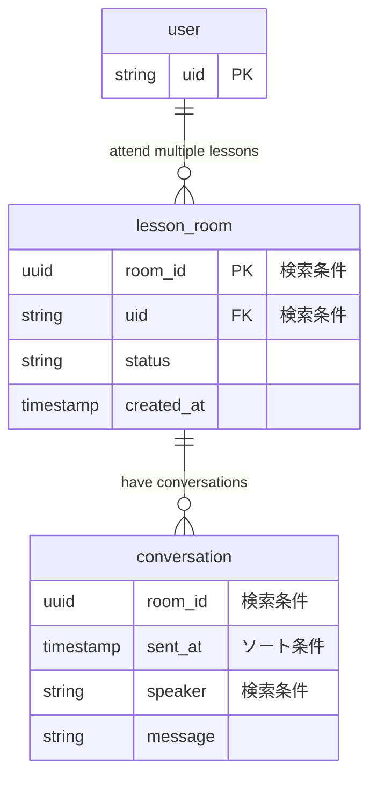

# DB Design

## Access Pattern

1. fetchActiveLessonRoomByUid
   1. LINE ユーザーからのリクエストに含まれる UID から、進行中のレッスンルーム ID を 1 件取得する
1. putLessonRoom
   1. 新しいレッスンルームを 1 件作成する
1. fetchConversationsByLessonRoomId
   1. レッスンルーム ID をもとに会話履歴を全件取得する
   2. ソート順は、送信日の降順
      1 . putLessonRoom
   3. レッスンルーム ID をもとにレッスンルームを「終了」に変更する

## ER Diagrams

## DynamoDB Schema

### SmallGPTalk Table

|                            | PrimaryKey               |                                       | Attributes         |                           |
| -------------------------- | ------------------------ | ------------------------------------- | ------------------ | ------------------------- | --- |
| Record Type                | PK                       | SK                                    |
| **lesson_room (type)**  | room_id [LESSON#uuid] | uid [USER#string]                  | status [string] | created_at [timestamp] |
| lesson_room (example)   | LESSON#fdba3e0a-9a...    | USER#4fab7256-ac..                    | IN_PROGGRESS       | 2023-03-10T13:50:40+09:00 |
| **conversation (type)** | room_id [LESSON#uuid] | sent_at [SENT_AT#timestamp]     | sender [string] | message [string]       |
| conversation (example)  | LESSON#fdba3e0a-9a...    | SENT_AT#2023-03-10T13:50:40+09:00  | user               | Hello!!!                  |     |

### Indecies

#### Primary Key

| Keys          | Attribute Name |
| ------------- | -------------- |
| Partition Key | PK             |
| Sort Key      | SK             |

#### GSI1

For the fetchLessonRoomByUid usecase.
| Keys | Attribute Name |
| ----------------- | -------------- |
| Partition Key | SK (USERS#{string}) |
| Sort Key | created_at |
