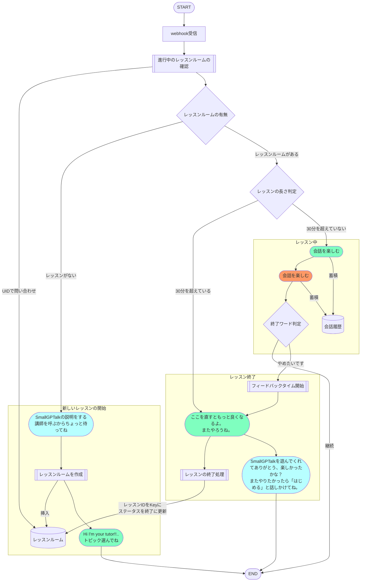

# Lesson Flow Chart

```mermaid
flowchart TD
  END(["END"])
  START(["START"]) --> L1["webhook受信"]
  L1 --> L2[["進行中のレッスンルームの確認"]]
  L2 --> |UIDで問い合わせ| DB_L[(レッスンルーム)]
  L2 --> L3{"レッスンルームの有無"}
  L3 -->|レッスンがない| S1(["SmallGPTalkの説明をする<br>講師を呼ぶからちょっと待ってね"]):::systemMessage

  subgraph 新しいレッスンの開始
    S1 --> L4[["レッスンルームを作成"]]
    L4 -->|挿入| DB_L
    L4 --> G1(["Hi I'm your tutor!!..<br>トピック選んでね"]):::gptMessage
  end
    G1 --> END

  subgraph レッスン中
    G2(["会話を楽しむ"]):::gptMessage --> U2(["会話を楽しむ"]):::usersMessage
    U2 --> L6{"終了ワード判定"}
    U2 -->|蓄積| DB_C[(会話履歴)]
    G2 -->|蓄積| DB_C[(会話履歴)]
  end
    L6 -->|継続| END

  subgraph レッスン終了
    L6 -->|やめたいです| L7[["フィードバックタイム開始"]]
    L7 --> G3(["ここを直すともっと良くなるよ。またやろうね。"]):::gptMessage
    G3 --> L10[[レッスンの終了処理]]
    L10 -->|レッスンIDをKeyに<br>ステータスを終了に更新| DB_L
    G3 --> S2(["SmallGPTalkを遊んでくれてありがとう、楽しかったかな？<br>またやりたかったら「はじめる」と話しかけてね。"]):::systemMessage
  end
    S2 --> END

  L3 -->|レッスンルームがある| L8{レッスンの長さ判定}
  L8 -->|30分を超えている| G3(["ここを直すともっと良くなるよ。<br>またやろうね。"]):::gptMessage
  L8 -->|30分を超えていない| G2

  classDef usersMessage fill:#f96
  classDef systemMessage fill:#b7ffff
  classDef gptMessage fill:#7fffbf
```
